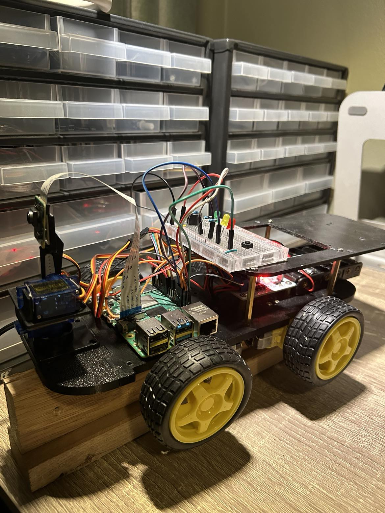
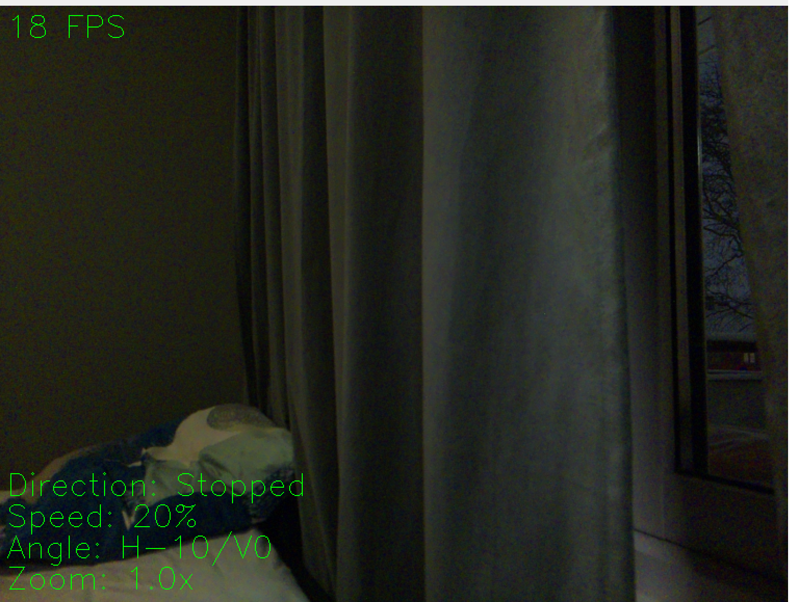

# Robocar

The robocar with Xbox controller
#Todo: add updated picture
<br />
<br />

<br />
Camera feed screenshot from camera onboard robocar

This a robotcar that is operated by voice commands. In addition to the controlling
of the car you can also control the direction of a mounted camera, zooming and
a honking device. To tell wether you've given a valid voice command, signal lights
will give you feedback.

## Prerequisites

### Setup Pi OS
Dowload and install the bookworm 64 bit version to run this project

### Setting up remote connection
1. Enable your VNC connection by first opening the configuration settings
```
sudo raspi-config
```
Enable Interface options -> VNC Enable

2. Find your ip adress for your raspberry pi
```
ifconfig
```
Look under wlan0 and find the adress after inet.

3. Download and install [RealVnc](https://www.realvnc.com/en/connect/download/combined/) for your OS.
Use the ip adress you found earlier to connect to your raspberry pi. Your pi needs to
be on the same network as the station you are connecting to it remotely from.

### Enable ssh
To run the pi from your PC you need to enable ssh
```
sudo systemctl start ssh
```
```
sudo systemctl enable ssh
```

### Clone this repo
Navigate to where you want this repo to be located
```
git clone https://github.com/Siggerud/RoboCar_3.0.git
```

### Downloading necessary libraries
Due to some versions of libraries that might not work
correctly together when installed through pip, we need to use
sudo apt for some of the libraries instead 

First reset pip
```
pip install pip==22.3.1 --break-system-packages
```

Install picamera2
```
pip install picamera2
```

Install opencv-python
```
pip install opencv-python
```

### Setting up pigpio
We need pigpio to control our servo, otherwise
there will be a lot of jitter.
```
sudo apt-get install pigpio 
```

Setup pipgio service to run at boot
```
sudo systemctl enable pigpiod
```

Then reboot or start pipgio
```
sudo systemctl start pigpiod
```

### Set up speech recognition
#### Connect your headphones to bluetooth

Start bluetooth and scan for heaphones
```
sudo systemctl start bluetooth
```
```
bluetoothctl
```
```
scan on
```

Copy the number before the name of your headphones
```
pair XX:XX:XX:XX:XX:XX
connect XX:XX:XX:XX:XX:XX
trust XX:XX:XX:XX:XX:XX
```

Exit bluetooth
```
Exit
```

Install utilites for using headphones with Pi
```
sudo apt install bluetooth bluez bluez-tools rfkill pulseaudio pavucontrol
```

Open PulseAudio Volume Control and mark your headphones as default
for input and output device. In the configuration tab set the profile for your
headphones to be HSF/HFP, this is to gain access to the build in microphone in the headphones.

#### Set up microphone for Speech Recognition

Install SpeechRecognition library
```
pip install SpeechRecognition==3.11
```

If you get an error here, then check if you forgot to downgrade pip to 22.3.1

Install SpeechRecognition dependencies
```
sudo apt install portaudio19-dev python3-pyaudio
```
```
pip install pyaudio
```
```
sudo apt install flac
```

Install sounddevice to avoid massive debug logging
```
pip install sounddevice
```

Insert index in this script to test microphone recording
```
import speech_recognition as sr
import sounddevice
import os

# Initialize recognizer class (for recognizing the speech)
r = sr.Recognizer()
r.dynamic_energy_threshold = True
r.energy_threshold = 400  # Experiment with values between 300 and 1500

with sr.Microphone(device_index=1) as source:  # Replace with your microphone index
    print("Talk")
    audio_text = r.listen(source)
    # Save audio to a file for debugging
    with open("output.wav", "wb") as f:
        f.write(audio_text.get_wav_data())
```

Play recording
```
aplay output.wav
```

If the step above went as expected, try the speech recognition
```
import speech_recognition as sr
import sounddevice
import os

# Initialize recognizer class (for recognizing the speech)
r = sr.Recognizer()
r.dynamic_energy_threshold = True
r.energy_threshold = 400  # Experiment with values between 300 and 1500


# Reading Microphone as source
# listening the speech and store in audio_text variable
with sr.Microphone(device_index=1) as source:
    print("Talk")
    audio_text = r.listen(source)
    print("Time over, thanks")
    # recoginze_() method will throw a request
    # error if the API is unreachable,
    # hence using exception handling

    try:
        # using google speech recognition
        print("Text: " + r.recognize_google(audio_text))
    except sr.UnknownValueError:
        print("Sorry, I did not get that")
    except sr.RequestError as e:
        print(f"Could not request results from Google Speech Recognition; {e}") 
```

If the output is what you communicated, the speech recognition works.

### Setup gyro and accelerometer
#### Enable I2C
```
sudo raspi-config
```

Go to Interface options -> I2C -> Enable

#### Install mpu6050 library for raspberry pi
```
pip install mpu6050-raspberrypi
```

### Add changes to config file if necessary
All components are setup through a config file that can be modified by you.
You can specify which pins you are using, angle rotation range for the camera
and you can specify the voice commands for specific operations in the language
of your choice.

## Starting up the program
1. Power your xbox controller and wait for it to connect to the pi
2. Connect to your pi via RealVNC
3. Open this project in a terminal 
4. Run the command 
```
python src/run.py
```
5. Press button to start car

## Driving and controlling the car
Give the commands given in the startup message when running the program.

### Exiting the program
Give the exit command given in the start up message to return to stand by mode. To start car again just press the
button again. To exit completely from stand by mode, press Ctrl + C.

## Appendix

### Wiring
#### Raspberry Pi to L289
22 -> IN2 <br />
18 -> IN1 <br />
16 -> IN4 <br />
15 -> IN3 <br />
11 -> ENA <br />
13 -> ENB <br /> 
GND -> GND

#### Raspberry pi to horizontal servo
37 -> SignalWire <br />
3.3V -> + <br />
GND -> -

#### Raspberry pi to vertical servo
33 -> SignalWire <br />
3.3V -> + <br />
GND -> -

#### Raspberry pi to camera
Cameraslot -> Camera

#### Raspberry pi to passive buzzer
36 -> +<br />
GND -> -

#### Raspberry pi to LEDs
Green LED<br />
32 -> +<br />
GND -> -<br />
<br />
Yellow LED<br />
31 -> +<br />
GND -> -<br />

Red LED<br />
29 -> +<br />
GND -> -<br />

#### Raspberry pi to button
38 -> button <br />
GND -> button <br />

#### L289 to motors
L289 right and left should be based on looking at the
l289 from above reading the text. <br /> 

L289 MOTORA Left -> Right motor front + <br /> 
L289 MOTORA Left -> Right motor back + <br /> 
L289 MOTORA Right -> Right motor back - <br /> 
L289 MOTORA Right -> Right motor front - <br /> 

L289 MOTORB Right -> Left motor front + <br /> 
L289 MOTORB Right -> Left motor back + <br /> 
L289 MOTORB Left -> Left motor back - <br /> 
L289 MOTORB Left -> Left motor front - <br />

#### L289 to batterypack
L289 VMS -> Batterypack +-<br />
L289 GND -> Batterypack -

### Parts list

#### Car handling
Battery pack holding 6AA batteries <br />
4 TT motors <br />
L289N motor driver <br />
4 wheels that attach to motors <br />

#### Other electrical components
Raspberry Pi 4 model B <br />
Raspberry pi Camera Module V2 <br />
Battery pack holding 6AA batteries <br />
Powerbank 10000mah <br />
2 SG90 servos <br />
Passive buzzer <br />
Breadboard <br />
1 green LED light<br />
1 yellow LED light <br />
1 red LED light<br />
3 330 Ohm resistor<br />
1 button

#### Structural components
3D printed parts <br />
4x M3 40 mm spacers <br />
4 metal brackets for motors <br />
M3 screws
M3 nuts
female to female wires
male to female wires


